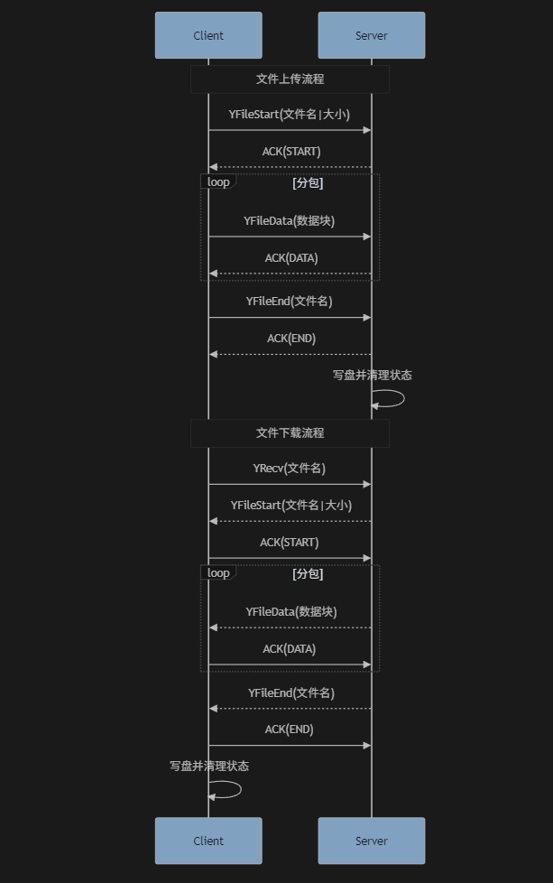
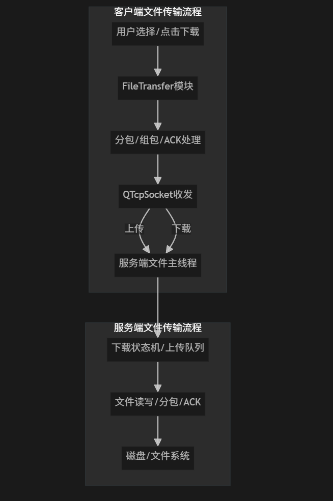
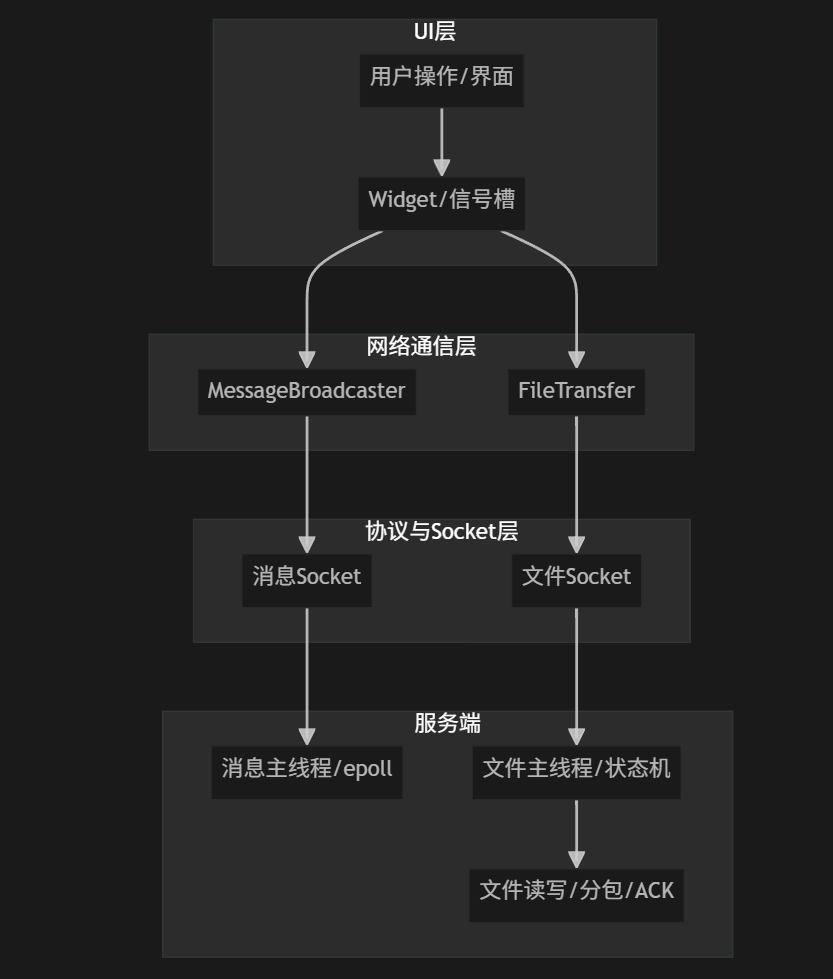

# LetsChat 文件传输功能完整流程总结

---

## 1. 文件上传（客户端 → 服务端）

### 1.1 客户端操作
- 用户选择文件，客户端调用`FileTransfer::sendFile`。
- 客户端新建socket连接文件端口，发送`YFileStart`包（内容：文件名|总字节数）。
- 客户端等待服务端ACK(START)，收到后分包发送`YFileData`，每发一包等待服务端ACK(DATA)。
- 所有数据包发完后，客户端发送`YFileEnd`，等待服务端ACK(END)。
- 收到ACK(END)后，客户端上传流程结束。

### 1.2 服务端操作
- 服务端收到`YFileStart`，创建`FileTransferState`，回ACK(START)。
- 服务端收到`YFileData`，数据入队，回ACK(DATA)。
- 服务端收到`YFileEnd`，写盘，回ACK(END)，清理状态。

---

## 2. 文件下载（服务端 → 客户端）

### 2.1 客户端操作
- 用户点击下载，客户端调用`FileTransfer::downloadFile`，发送`YRecv`包（内容：文件名）。
- 客户端等待服务端`YFileStart`，收到后回ACK(START)。
- 客户端收到`YFileData`，写入本地文件，每收一包回ACK(DATA)。
- 客户端收到`YFileEnd`，关闭文件，回ACK(END)，下载完成。

### 2.2 服务端操作
- 服务端收到`YRecv`，查找文件，创建`DownloadState`，发送`YFileStart`，等待ACK(START)。
- 服务端收到ACK(START)，分包发送`YFileData`，每发一包等待ACK(DATA)。
- 所有数据发完后，发送`YFileEnd`，等待ACK(END)，清理状态。

---

## 3. 信号与状态机说明

- **所有ACK包都必须及时flush，保证状态推进。**
- 服务端下载状态机推进全部靠ACK驱动，主线程顺序处理，避免粘包/乱序。
- 上传/下载流程互不干扰，状态机独立。

---

# 4. 流程图

## 4.1 文件传输时序图

> 上传/下载全流程时序

## 4.2 客户端-服务端分层结构

> 展示UI、网络、协议、服务端各层关系

## 4.3 文件传输详细流程

> 客户端与服务端文件传输详细流转

---

## 5. 关键优化点

- 服务端下载流程采用**状态机+ACK驱动**，所有socket数据主线程顺序处理，彻底消除粘包/分包/乱序问题。
- 客户端每次ACK后强制flush，保证服务端及时收到ACK，状态机不断推进。
- 上传/下载流程分离，互不干扰，便于维护和扩展。

---

如需更详细的代码注释、协议包格式说明或UI/多线程/断点续传等扩展建议，欢迎随时提出！
